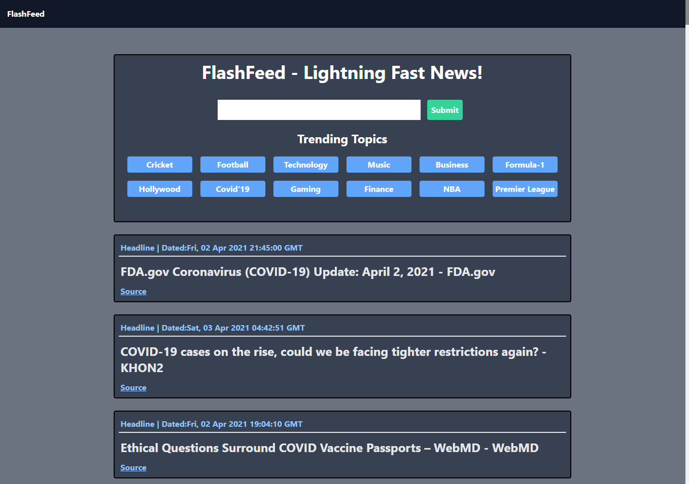

# Flash-Feed
  Django Powered News Feed




# Features
  - Simple , Neat UI made with Tailwind
  - Custom Search Functionality.
  - Various Predefined Categories

# Installation/Usage
  - Run The Following Command to install dependencies
 ```sh
   pip install -r requirements.txt
 ```
   - To Run the application
 ```sh
   python manage.py runserver
 ```

# TODO
  - Geolocation Based News
  - Sports Scores, Stock Updates, etc.
